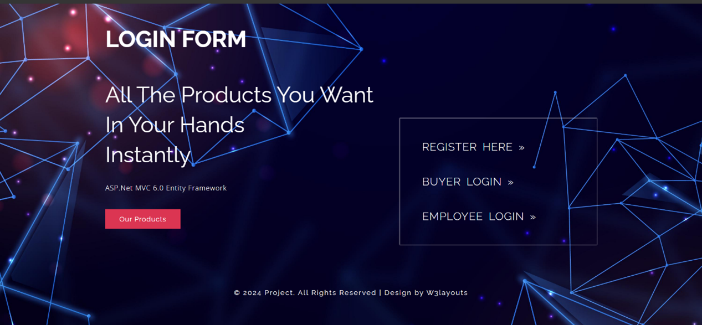
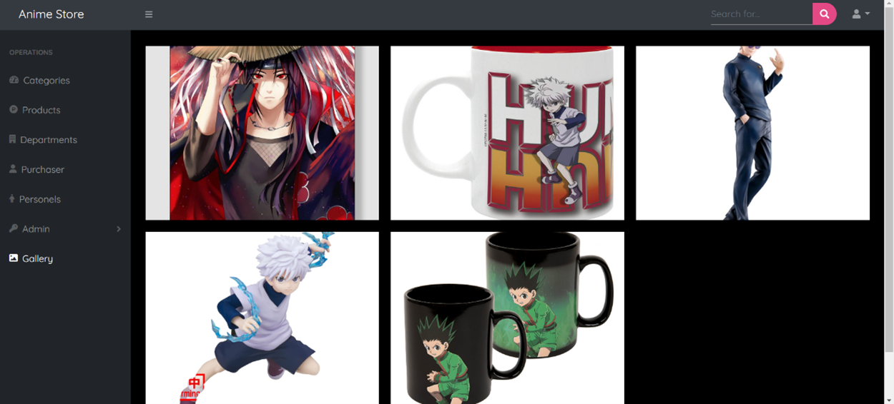
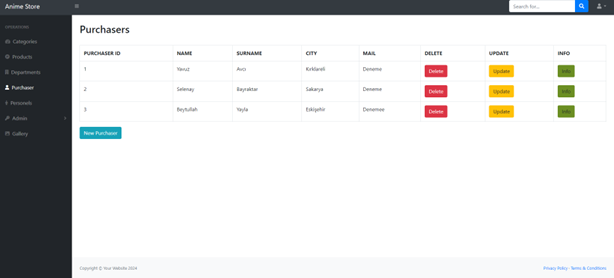
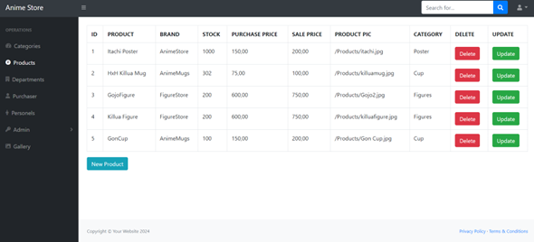

# Anime Store Management System 🛒

A comprehensive web-based e-commerce and management system developed using ASP.NET Core 6.0 MVC. This project digitizes the operational processes of a boutique anime store, featuring Role-Based Access Control (RBAC) for admins, employees, and customers. It streamlines inventory management and store operations by transforming manual workflows into a centralized digital platform.

## 🚀 Technologies Used
* **Framework:** ASP.NET Core 6.0 (MVC Architecture)
* **Database:** MSSQL with Entity Framework Core (Code First)
* **Frontend:** HTML5, CSS3, JavaScript, Bootstrap
* **Key Features:** SQL Triggers, Stored Procedures, LINQ Queries

## 📂 Key Functionalities
* **Role-Based Authentication:** Secure login system for Admins, Employees, and Customers.
* **Admin Dashboard:** Manage products, categories, and view sales reports.
* **Inventory Management:** CRUD operations for products with image upload support.
* **Sales Tracking:** Monitor daily earnings and employee performance.
* **Dynamic Gallery:** Interactive product showcase for customers.

## 📸 Project Screenshots

### Login Page

### Products Gallery

### Employee Dashboard Customer

### Employee Dashboard Products

